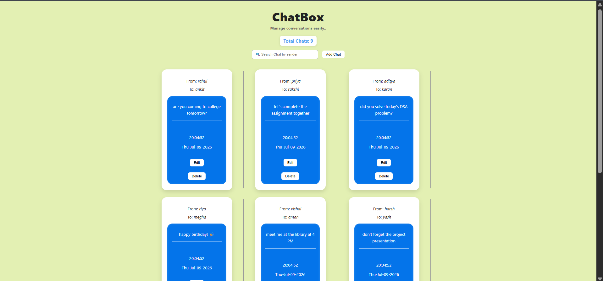

# 💬 ChatBox

A simple CRUD Chat Application built with **Node.js**, **Express.js**, **MongoDB**, and **EJS**.


---

## 📖 About

ChatBox is a beginner-friendly backend project developed to understand how CRUD operations work using Express and MongoDB.
Users can create, edit, delete, and search chats through a clean interface while learning RESTful routing and server-side rendering with EJS.

---

## ✨ Features

- 💬 Create chats
- 📋 View chats
- ✏️ Edit chats
- 🗑️ Delete chats
- 🔍 Search by sender
- 💾 MongoDB database
- 🎨 Responsive UI

---

## 🛠️ Tech Stack

- Node.js
- Express.js
- MongoDB
- Mongoose
- EJS
- HTML
- CSS
- JavaScript

---

## 🚀 Running the Project

```bash
npm install
node index.js
```

Open:

```
http://localhost:8080
```

---

## 📚 What I Learned

- CRUD Operations
- RESTful Routing
- Express.js
- MongoDB & Mongoose
- EJS
- Backend Project Structure

---

## 🚧 Future Improvements

- User Authentication
- Real-time Chat
- Dark Mode
- Better Mobile UI

---

## 👨‍💻 Author
~ Akshra Srivastava

GitHub: https://github.com/akshra-s
