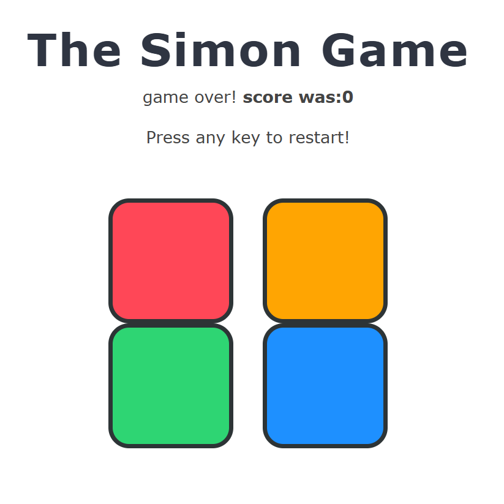
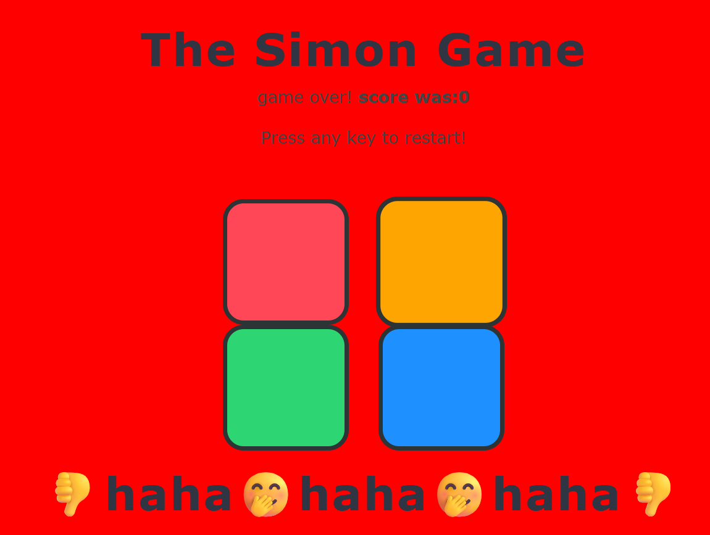

# 🎮 Simon Game

A simple browser-based **Simon Memory Game** built using **HTML, CSS, and JavaScript**.

The game tests your memory by generating an increasingly long sequence of colors. Watch the pattern carefully and repeat it correctly to move to the next level. One wrong click and the game is over!

---

## 📸 Screenshots

### Game Interface



### Game Over Screen



---

## 🚀 Features

- Classic Simon Game mechanics
- Random color sequence generation
- Increasing difficulty with each level
- Score/Level tracking
- Game Over screen with restart option
- Responsive and clean UI
- Smooth button animations

---

## 🛠️ Built With

- HTML5
- CSS3
- JavaScript (Vanilla)

---

## 🎯 How to Play

1. Open the game in your browser.
2. Press any key to start.
3. Watch the sequence shown by the game.
4. Repeat the sequence by clicking the colored buttons.
5. Every correct sequence increases the level.
6. A wrong click ends the game.
7. Press any key to restart and try again.

---

## 📂 Project Structure

```
Simon-Game/
│── index.html
│── style.css
│── script.js
│── README.md
└── images/
    ├── preview-light.png
    └── preview-gameover.png
```

---

## 💡 What I Learned

While building this project, I practiced:

- DOM Manipulation
- Event Handling
- Arrays and Sequence Logic
- JavaScript Functions
- Conditional Statements
- CSS Styling & Animations
- Game State Management

---

## ▶️ Run Locally

Clone the repository:

```bash
git clone https://github.com/your-username/Simon-Game.git
```

Open the project folder and run `index.html` in your browser.

---

## 📜 License

This project is open-source and available under the MIT License.

---

### ⭐ If you liked this project, consider giving it a star!
