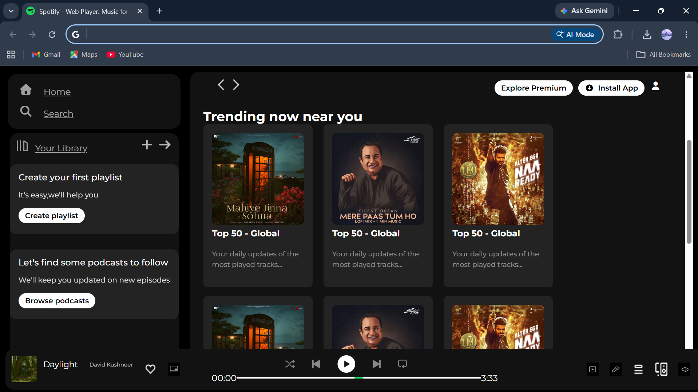

# 🎵 Spotify Clone

A responsive Spotify-inspired user interface built using **HTML5** and **CSS3**.

This project was created to practice modern web design by recreating the layout and visual appearance of Spotify's web player. The focus was on building a clean, responsive interface using only HTML and CSS.

---

## 📖 About

This project is a static frontend clone of Spotify's homepage. It replicates the overall design, layout, and styling while helping me strengthen my understanding of responsive web design, Flexbox, and CSS positioning.

---

## 📸 Preview



---

## ✨ Features

- 🎵 Spotify-inspired interface
- 📱 Responsive layout
- 🎨 Modern UI design
- 📂 Sidebar navigation
- 🎧 Music player section
- 💻 Built entirely with HTML & CSS

---

## 🛠️ Tech Stack

- HTML5
- CSS3

---

## 📂 Project Structure

```text
spotify-clone/
│
├── images/
├── index.html
├── style.css
└── README.md
```

---

## 🚀 Getting Started

Clone the repository

```bash
git clone https://github.com/akshra-s/web-projects.git
```

Navigate to the project folder

```bash
cd web-projects/spotify-clone
```

Open `index.html` in your preferred web browser.

---

## 📚 What I Learned

This project helped me improve my understanding of:

- Semantic HTML
- CSS Flexbox
- Responsive Web Design
- Layout Structuring
- Positioning & Alignment
- UI Replication from a Real Website

---

## 🚧 Future Improvements

- Add JavaScript functionality
- Music playback controls
- Dark & Light mode
- Responsive improvements
- Spotify API integration

---

## 👨‍💻 Author

**Akshra Srivastava**

GitHub: https://github.com/akshra-s

---

⭐ Thanks for checking out this project!
