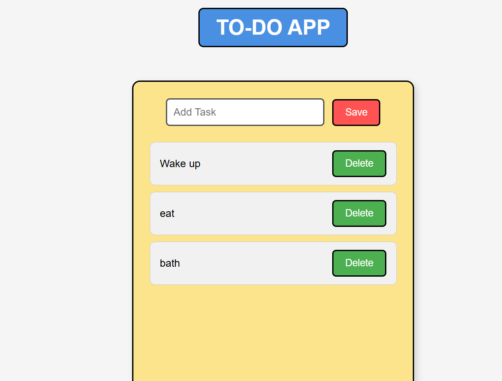

# ✅ Simple Todo List App

A simple Todo List application built using **HTML, CSS, and JavaScript**.  
This project allows users to add and manage their daily tasks through a simple and clean interface.

## 📸 Preview



## 🚀 Features

- ➕ Add new tasks
- ❌ Delete tasks
- 📋 Display all added tasks

## 🛠️ Technologies Used

- **HTML5** - Used to create the structure of the application
- **CSS3** - Used for styling and layout
- **JavaScript** - Used to add functionality and handle user actions

## 📂 Project Structure

```
Todo-List-App/
│
├── index.html      # Main HTML file
├── style.css       # CSS styling file
└── script.js       # JavaScript functionality
```

## ▶️ How to Run

1. Clone or download this repository.
2. Open the project folder.
3. Open `index.html` in your browser.
4. Add and manage your tasks.

## 🎯 Project Purpose

This project was created to practice the basics of frontend web development, including:
- Creating webpage structures using HTML
- Designing layouts using CSS
- Using JavaScript for DOM manipulation and user interaction

## 🔮 Future Improvements

- Add task completion feature
- Add local storage to save tasks
- Add edit task option
- Improve UI and animations

## 👨‍💻 Author

**Akshra Srivastava**

---

⭐ Feel free to explore and improve this project!
