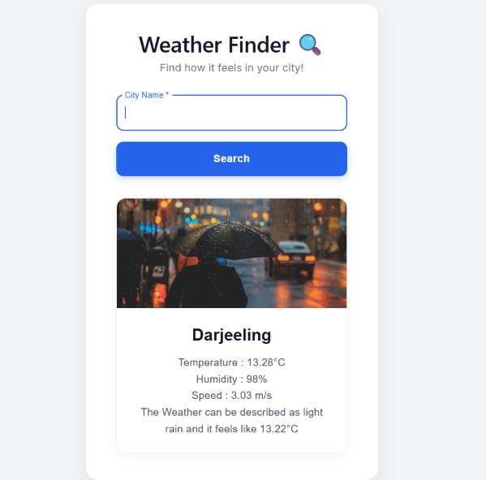

# 🌤️ Weather App

A simple Weather App built using **React.js, JavaScript, CSS, and Material UI**.  
This project allows users to search for a city and view its current weather information.

## 📸 Preview



## 🚀 Features

- 🔍 Search weather by city name
- 🌡️ Display current temperature
- 💧 Display humidity,wind speed,feels-like temperature
- ☁️ Show weather condition,description,related image
- 📱 Simple and clean user interface

## 🛠️ Technologies Used

- **React.js** - Used to build the application and manage components
- **JavaScript** - Used for functionality and handling weather data
- **CSS** - Used for styling and layout
- **Material UI** - Used for UI components
- **Vite** - Used as the development and build tool
- **OpenWeatherMap API** - Used to fetch weather data

## 📂 Project Structure

```text
weather-app/
│
├── public/
│
├── src/
│   ├── assets/
│   │   └── hero.png
│   ├── App.css
│   ├── App.jsx
│   ├── Infobox.jsx
│   ├── index.css
│   ├── main.jsx
│   ├── Search.css
│   ├── Search.jsx
│   └── Weatherapp.jsx
│
├── .gitignore
├── eslint.config.js
├── index.html
├── package.json
├── package-lock.json
└── vite.config.js
```

## ▶️ How to Run

1. Clone or download this repository.
2. Open the `weather-app` folder in the terminal.
3. Install the required dependencies:

```bash
npm install
```

4. Create a `.env` file in the project folder and add your OpenWeatherMap API key.

```env
VITE_WEATHER_API_KEY=your_api_key_here
```

5. Start the development server:

```bash
npm run dev
```

6. Open the local URL shown in the terminal.

## 🎯 Project Purpose

This project was created to practice **React.js, state management, and API integration**, including:

- Creating and using React components
- Managing state using `useState`
- Handling user input
- Fetching weather data from an API
- Passing data between components
- Using Material UI components


## 👨‍💻 Author

**Akshra Srivastava**

---

⭐ Feel free to explore and improve this project!
